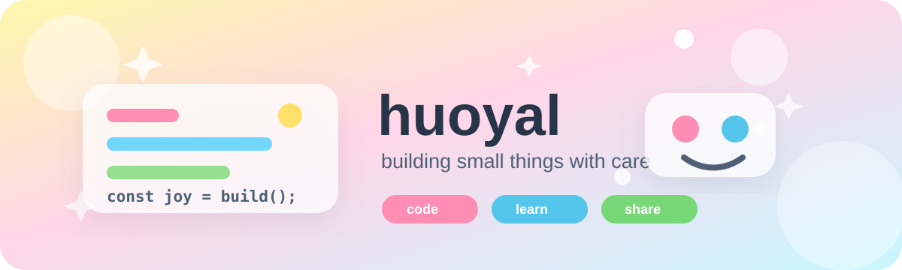
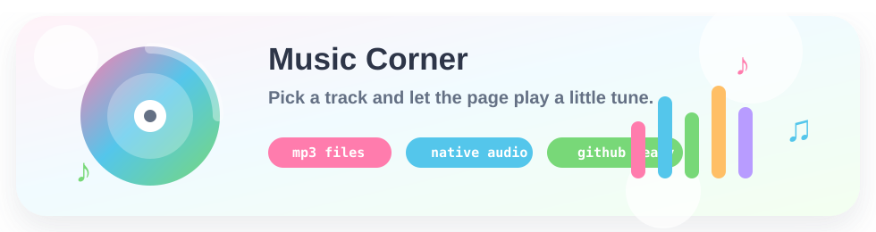

  

  

  
  
  

## Little Notes

- I use this profile as a small index for learning, projects, and experiments.
- I like practical tools, clean interfaces, and code that is easy to maintain.
- Current direction: frontend basics, backend fundamentals, and useful automation.
- More personal details and featured work will be added as the repository grows.

## Music Corner

  

  

  GitHub README cannot run custom JavaScript, so the full player lives on GitHub Pages.
  Quick play links:
  <a href="https://raw.githubusercontent.com/huoyal/huoyal/main/assets/Oturans%20-%20%E3%80%90%E9%92%A2%E7%90%B4%E3%80%91%E5%8D%83%E6%9C%AC%E6%A8%B1.mp3">Oturans - 【钢琴】千本樱</a>
  ·
  <a href="https://raw.githubusercontent.com/huoyal/huoyal/main/assets/%E5%A4%A9%E6%98%93%20-%20%E4%B8%8D%E8%B4%A5%E8%BF%9B%E8%A1%8C%E6%9B%B2%20DJ%E6%85%A2%E6%91%87.mp3">天易 - 不败进行曲 DJ慢摇</a>

## Toolbox

  

## GitHub Dashboard

  
  

  

## Activity Garden

  

## Featured

  

## Connect

  

  

